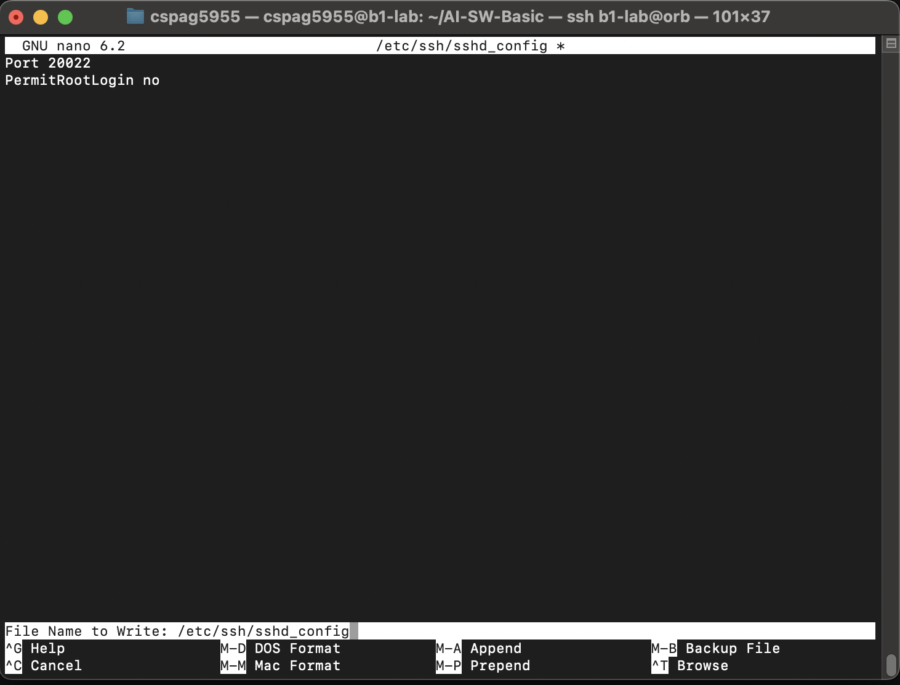
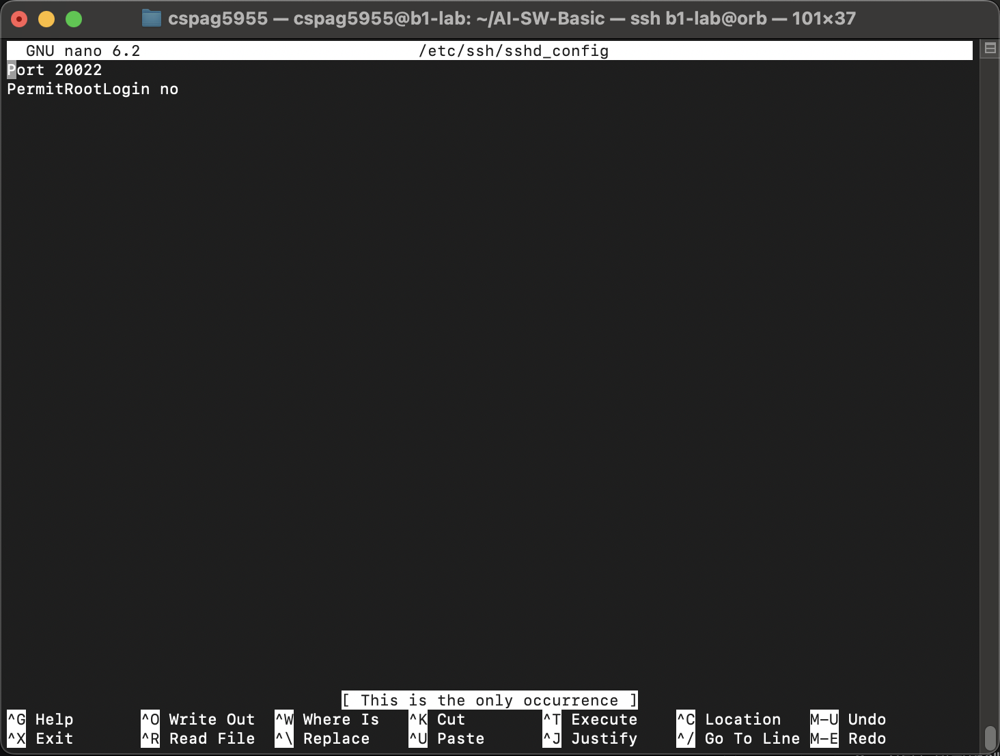
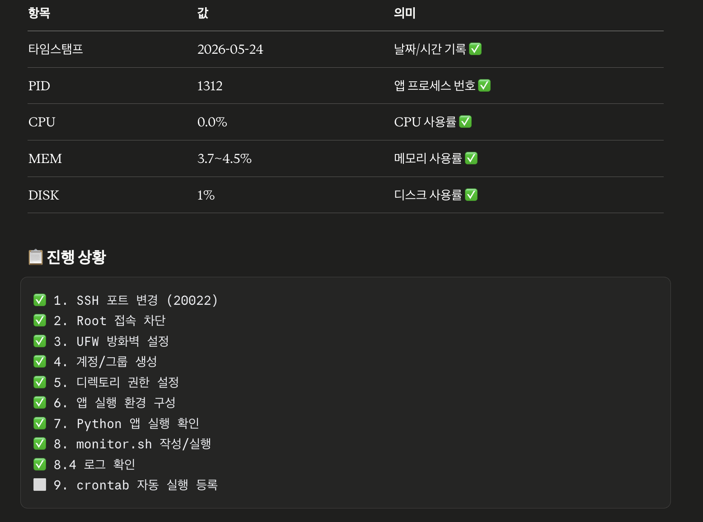
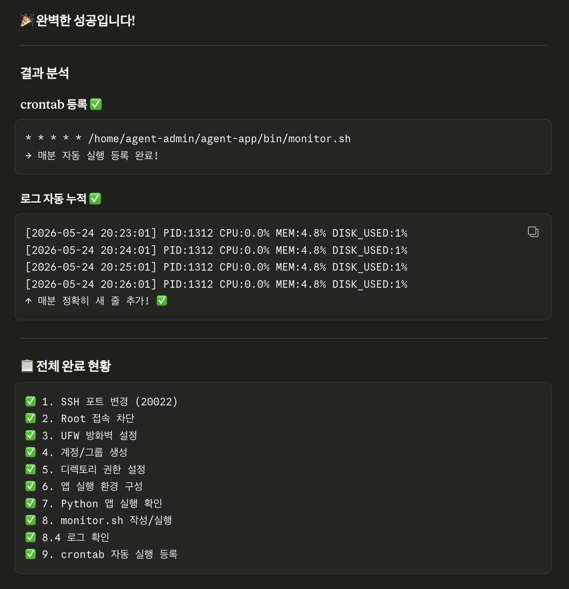
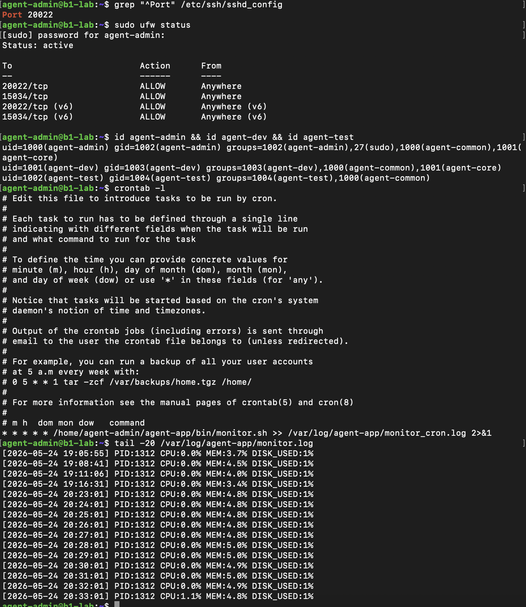

# B1-1 따라하기 교본: 시스템 관제 자동화 스크립트 개발

> **이 교본은?**
> 리눅스를 처음 접하거나 아직 익숙하지 않은 분들을 위해, 미션의 모든 단계를 **왜 하는지** 설명과 함께 **명령어 한 줄씩** 따라할 수 있도록 작성했습니다.
> 순서대로 따라가면 미션을 완성할 수 있습니다.

---

## 목차

1. [시작 전 준비](#1-시작-전-준비)
2. [SSH 보안 설정](#2-ssh-보안-설정)
3. [방화벽 설정 (UFW)](#3-방화벽-설정-ufw)
4. [계정 및 그룹 생성](#4-계정-및-그룹-생성)
5. [디렉토리 구조 및 권한 설정](#5-디렉토리-구조-및-권한-설정)
6. [애플리케이션 실행 환경 구성](#6-애플리케이션-실행-환경-구성)
7. [Python 앱 실행 확인](#7-python-앱-실행-확인)
8. [monitor.sh 스크립트 작성](#8-monitorsh-스크립트-작성)
9. [crontab 자동 실행 등록](#9-crontab-자동-실행-등록)
10. [최종 확인 체크리스트](#10-최종-확인-체크리스트)
11. [보너스 과제 (선택)](#11-보너스-과제-선택)

---

## 1. 시작 전 준비

### 1.1 환경 확인

이 미션은 **Ubuntu 22.04 LTS** 환경에서 진행합니다.
컨테이너(Docker) 또는 VM(VirtualBox, UTM 등)으로 Ubuntu를 구성한 상태에서 시작하세요.

```bash
# 현재 OS 버전 확인
cat /etc/os-release

결과
cspag5955@b1-lab:~/AI-SW-Basic$ cat /etc/os-release
PRETTY_NAME="Ubuntu 22.04.5 LTS"
NAME="Ubuntu"
VERSION_ID="22.04"
VERSION="22.04.5 LTS (Jammy Jellyfish)"
VERSION_CODENAME=jammy
ID=ubuntu
ID_LIKE=debian
HOME_URL="https://www.ubuntu.com/"
SUPPORT_URL="https://help.ubuntu.com/"
BUG_REPORT_URL="https://bugs.launchpad.net/ubuntu/"
PRIVACY_POLICY_URL="https://www.ubuntu.com/legal/terms-and-policies/privacy-policy"
UBUNTU_CODENAME=jammy

# 현재 로그인한 사용자 확인
whoami

# sudo 권한 확인 (이 명령이 오류 없이 실행되면 OK)
sudo whoami
```

결과
cspag5955@b1-lab:~/AI-SW-Basic$ whoami
cspag5955
cspag5955@b1-lab:~/AI-SW-Basic$ sudo whoami
root

> **Tip:** sudo는 "superuser do"의 줄임말로, 관리자 권한이 필요한 명령 앞에 붙입니다.
> 처음에는 root 또는 sudo 권한이 있는 기본 계정(예: ubuntu)으로 시작합니다.

### 1.2 필수 패키지 설치

```bash
# 패키지 목록 최신화
sudo apt update

결과
cspag5955@b1-lab:~/AI-SW-Basic$ sudo apt update
Hit:1 https://deb.nodesource.com/node_20.x nodistro InRelease
Get:2 http://security.ubuntu.com/ubuntu jammy-security InRelease [129 kB]  
Hit:3 http://archive.ubuntu.com/ubuntu jammy InRelease                                
Get:4 http://archive.ubuntu.com/ubuntu jammy-updates InRelease [128 kB]
Get:5 http://archive.ubuntu.com/ubuntu jammy-updates/main amd64 Packages [3524 kB]
Get:6 http://archive.ubuntu.com/ubuntu jammy-updates/universe amd64 Packages [1269 kB]
Fetched 5050 kB in 4s (1408 kB/s)                     
Reading package lists... Done
Building dependency tree... Done
Reading state information... Done
All packages are up to date.


# 필수 도구 설치 (acl: 세밀한 권한 설정, ufw: 방화벽, net-tools: 네트워크 확인)
sudo apt install -y acl ufw net-tools
```
결과
cspag5955@b1-lab:~/AI-SW-Basic$ sudo apt install -y acl ufw net-tools
Reading package lists... Done
Building dependency tree... Done
Reading state information... Done
acl is already the newest version (2.3.1-1).
net-tools is already the newest version (1.60+git20181103.0eebece-1ubuntu5.4).
ufw is already the newest version (0.36.1-4ubuntu0.1).
0 upgraded, 0 newly installed, 0 to remove and 0 not upgraded.

---

## 2. SSH 보안 설정

### 왜 SSH 포트를 바꾸나요?

기본 SSH 포트는 **22번**입니다. 전 세계 해커들의 자동 공격 스크립트가 22번 포트를 집중 공격합니다.
포트를 **20022**로 바꾸면 자동화된 공격 대부분을 피할 수 있습니다.

Root 원격 접속 차단은, 혹시라도 비밀번호가 유출되더라도 직접 서버를 장악하지 못하게 막는 역할을 합니다.

### 2.1 SSH 설정 파일 편집

```bash
# SSH 설정 파일 열기
sudo nano /etc/ssh/sshd_config
```

파일이 열리면 아래 항목을 찾아서 수정합니다.

**수정 전:**
```
#Port 22
#PermitRootLogin prohibit-password
```

**수정 후:**
```
Port 20022
PermitRootLogin no

결과

```


> **nano 편집기 사용법:**
> - 화살표 키로 이동
> - `Ctrl + W` : 텍스트 검색 (Port 검색해서 찾으면 편합니다)
> - `Ctrl + O` : 저장 (Enter로 확인)
> - `Ctrl + X` : 종료

### 2.2 SSH 서비스 재시작

```bash
# 설정 변경 후 SSH 서비스 재시작
sudo systemctl restart sshd
```

### 2.3 확인

```bash
# 설정 파일에서 Port와 PermitRootLogin 확인
grep -E "^Port|^PermitRootLogin" /etc/ssh/sshd_config

결과
cspag5955@b1-lab:~/AI-SW-Basic$ grep -E "^Port|^PermitRootLogin" /etc/ssh/sshd_config
Port 20022
PermitRootLogin no

# 20022 포트로 SSH가 실제 듣고(Listen) 있는지 확인
sudo ss -tulnp | grep sshd
```

**정상 출력 예시:**
```
tcp   LISTEN  0  128  0.0.0.0:20022  0.0.0.0:*  users:(("sshd",pid=...,fd=...))

```
결과
cspag5955@b1-lab:~/AI-SW-Basic$ grep -E "^Port|^PermitRootLogin" /etc/ssh/sshd_config
Port 20022
PermitRootLogin no
cspag5955@b1-lab:~/AI-SW-Basic$ sudo ss -tulnp | grep sshd
tcp   LISTEN 0      128                0.0.0.0:20022      0.0.0.0:*    users:(("sshd",pid=13486,fd=3))          
tcp   LISTEN 0      128                   [::]:20022         [::]:*    users:(("sshd",pid=13486,fd=4))  


> **주의:** 이후 SSH로 접속할 때는 포트 번호를 명시해야 합니다.
> ```bash
> ssh -p 20022 사용자명@서버IP
> ```

---

## 3. 방화벽 설정 (UFW)

### 왜 방화벽이 필요한가요?

방화벽은 서버의 "문지기"입니다. 허가된 포트로 들어오는 연결만 통과시키고, 나머지는 모두 차단합니다.
우리 서버에는 **SSH(20022)** 와 **앱 포트(15034)** 만 열어줍니다.

### 3.1 UFW 활성화 및 규칙 설정

```bash
# SSH 포트 허용 (이것을 먼저 해야 나중에 SSH 접속이 끊기지 않습니다!)
sudo ufw allow 20022/tcp

결과
cspag5955@b1-lab:~/AI-SW-Basic$ sudo ufw allow 20022/tcp
Skipping adding existing rule
Skipping adding existing rule (v6)

# 앱 포트 허용
sudo ufw allow 15034/tcp


결과
cspag5955@b1-lab:~/AI-SW-Basic$ sudo ufw allow 15034/tcp
Rule added
Rule added (v6)


# UFW 활성화 (y 입력으로 확인)
sudo ufw enable

# 방화벽 상태 확인
sudo ufw status

```

**정상 출력 예시:**
```
Status: active

To                         Action      From
--                         ------      ----
20022/tcp                  ALLOW       Anywhere
15034/tcp                  ALLOW       Anywhere
20022/tcp (v6)             ALLOW       Anywhere (v6)
15034/tcp (v6)             ALLOW       Anywhere (v6)

결과
cspag5955@b1-lab:~/AI-SW-Basic$ sudo ufw status
Status: active

To                         Action      From
--                         ------      ----
20022/tcp                  ALLOW       Anywhere                  
15034/tcp                  ALLOW       Anywhere                  
20022/tcp (v6)             ALLOW       Anywhere (v6)             
15034/tcp (v6)             ALLOW       Anywhere (v6)  
```

> **Tip:** `ufw enable` 전에 반드시 SSH 포트를 허용해야 합니다.
> 그렇지 않으면 SSH 연결이 끊겨서 서버에 접근할 수 없게 됩니다!

---

## 4. 계정 및 그룹 생성

### 왜 역할별 계정을 만드나요?

실제 회사에서는 개발자, 운영자, 테스터 등 역할마다 접근할 수 있는 파일과 기능이 다릅니다.
이를 **최소 권한 원칙**이라고 합니다 — 필요한 것만 허용하고, 나머지는 막습니다.

| 계정 | 역할 |
|------|------|
| agent-admin | 운영/관리자, cron 실행 |
| agent-dev | 개발자, monitor.sh 작성 |
| agent-test | QA/테스터 |

| 그룹 | 포함 계정 | 용도 |
|------|----------|------|
| agent-common | admin, dev, test | 공유 디렉토리 접근 |
| agent-core | admin, dev | 보안 디렉토리 접근 |

### 4.1 그룹 생성

```bash
# 그룹 먼저 생성 (계정보다 그룹을 먼저 만들어야 합니다)
sudo groupadd agent-common
sudo groupadd agent-core

# 그룹 생성 확인
grep "agent-" /etc/group
```

결과
cspag5955@b1-lab:~/AI-SW-Basic$ sudo groupadd agent-common
cspag5955@b1-lab:~/AI-SW-Basic$ sudo groupadd agent-core
cspag5955@b1-lab:~/AI-SW-Basic$ grep "agent-" /etc/group
agent-common:x:1000:
agent-core:x:1001:

### 4.2 계정 생성

```bash
# agent-admin 계정 생성
# -m : 홈 디렉토리 자동 생성
# -s /bin/bash : 기본 셸을 bash로 설정
sudo useradd -m -s /bin/bash agent-admin

# agent-dev 계정 생성
sudo useradd -m -s /bin/bash agent-dev

# agent-test 계정 생성
sudo useradd -m -s /bin/bash agent-test
```

### 4.3 비밀번호 설정

```bash
# 각 계정에 비밀번호 설정 (실습용이므로 간단하게 설정해도 됩니다)
sudo passwd agent-admin  => 1234로 설정함
sudo passwd agent-dev  => abcd로 설정함
sudo passwd agent-test. => 5678
```

### 4.4 그룹에 계정 추가

```bash
# agent-common 그룹에 3개 계정 추가
sudo usermod -aG agent-common agent-admin
sudo usermod -aG agent-common agent-dev
sudo usermod -aG agent-common agent-test

# agent-core 그룹에 2개 계정 추가
sudo usermod -aG agent-core agent-admin
sudo usermod -aG agent-core agent-dev
```

> **`-aG` 옵션 설명:**
> - `-a` : append(추가). 이미 속한 그룹을 유지하면서 추가합니다.
> - `-G` : 보조 그룹 지정
> `-a` 없이 `-G`만 쓰면 기존 그룹이 모두 제거되니 반드시 `-aG`를 함께 씁니다!

### 4.5 확인

```bash
# 각 계정의 그룹 소속 확인
id agent-admin
id agent-dev
id agent-test
```

**정상 출력 예시 (agent-admin):**
```
uid=1001(agent-admin) gid=1001(agent-admin) groups=1001(agent-admin),1002(agent-common),1003(agent-core)
```

결과
cspag5955@b1-lab:~/AI-SW-Basic$ id agent-admin
uid=1000(agent-admin) gid=1002(agent-admin) groups=1002(agent-admin),1000(agent-common),1001(agent-core)
cspag5955@b1-lab:~/AI-SW-Basic$ id agent-dev
uid=1001(agent-dev) gid=1003(agent-dev) groups=1003(agent-dev),1000(agent-common),1001(agent-core)
cspag5955@b1-lab:~/AI-SW-Basic$ id agent-test
uid=1002(agent-test) gid=1004(agent-test) groups=1004(agent-test),1000(agent-common)


---

## 5. 디렉토리 구조 및 권한 설정

### 5.1 AGENT_HOME 디렉토리 구조 생성

```bash
# agent-admin 홈 디렉토리 아래에 앱 디렉토리 생성
sudo mkdir -p /home/agent-admin/agent-app
sudo mkdir -p /home/agent-admin/agent-app/upload_files
sudo mkdir -p /home/agent-admin/agent-app/api_keys
sudo mkdir -p /home/agent-admin/agent-app/bin

# 로그 디렉토리 생성
sudo mkdir -p /var/log/agent-app

실행
cspag5955@b1-lab:~/AI-SW-Basic$ sudo mkdir -p /home/agent-admin/agent-app
cspag5955@b1-lab:~/AI-SW-Basic$ sudo mkdir -p /home/agent-admin/agent-app/upload_files
cspag5955@b1-lab:~/AI-SW-Basic$ sudo mkdir -p /home/agent-admin/agent-app/api_keys
cspag5955@b1-lab:~/AI-SW-Basic$ sudo mkdir -p /home/agent-admin/agent-app/bin
cspag5955@b1-lab:~/AI-SW-Basic$ sudo mkdir -p /var/log/agent-app
```

### 5.2 소유자 및 그룹 설정

```bash
# agent-app 전체 소유자를 agent-admin으로 변경
sudo chown -R agent-admin:agent-admin /home/agent-admin/agent-app

# upload_files: 그룹을 agent-common으로 설정
sudo chown agent-admin:agent-common /home/agent-admin/agent-app/upload_files

# api_keys: 그룹을 agent-core로 설정
sudo chown agent-admin:agent-core /home/agent-admin/agent-app/api_keys

# /var/log/agent-app: 그룹을 agent-core로 설정
sudo chown agent-admin:agent-core /var/log/agent-app

실행
cspag5955@b1-lab:~/AI-SW-Basic$ sudo chown -R agent-admin:agent-admin /home/agent-admin/agent-app
cspag5955@b1-lab:~/AI-SW-Basic$ sudo chown agent-admin:agent-common /home/agent-admin/agent-app/upload_files
cspag5955@b1-lab:~/AI-SW-Basic$ sudo chown agent-admin:agent-core /home/agent-admin/agent-app/api_keys
cspag5955@b1-lab:~/AI-SW-Basic$ sudo chown agent-admin:agent-core /var/log/agent-app
```

### 5.3 권한(Permission) 설정

리눅스 권한은 3자리 숫자(또는 문자)로 표현됩니다:
- `7 (rwx)` = 읽기(4) + 쓰기(2) + 실행(1)
- `5 (r-x)` = 읽기(4) + 실행(1)
- `0 (---)` = 아무 권한 없음

```bash
# upload_files: 소유자와 그룹(agent-common) 모두 읽기/쓰기 가능, 외부 차단
# 2775 = setgid 비트 포함 (새 파일이 그룹을 자동 상속)
sudo chmod 2775 /home/agent-admin/agent-app/upload_files

# api_keys: 소유자만 완전 권한, 그룹은 읽기만, 외부 차단
sudo chmod 750 /home/agent-admin/agent-app/api_keys

# /var/log/agent-app: 그룹(agent-core)이 읽기/쓰기 가능
sudo chmod 770 /var/log/agent-app
```

### 5.4 ACL(Access Control List)로 세밀한 권한 추가

ACL은 기본 권한보다 더 세밀하게 권한을 설정할 수 있는 기능입니다.

```bash
# upload_files: agent-common 그룹에 읽기/쓰기 허용
sudo setfacl -m g:agent-common:rwx /home/agent-admin/agent-app/upload_files
# 새로 생성되는 파일에도 자동 적용 (default ACL)
sudo setfacl -d -m g:agent-common:rwx /home/agent-admin/agent-app/upload_files

# api_keys: agent-core 그룹에만 읽기/쓰기 허용
sudo setfacl -m g:agent-core:rwx /home/agent-admin/agent-app/api_keys
sudo setfacl -d -m g:agent-core:rwx /home/agent-admin/agent-app/api_keys

# /var/log/agent-app: agent-core 그룹에 읽기/쓰기 허용
sudo setfacl -m g:agent-core:rwx /var/log/agent-app
sudo setfacl -d -m g:agent-core:rwx /var/log/agent-app
```

### 5.5 권한 확인

```bash
# 일반 권한 확인
ls -la /home/agent-admin/agent-app/


결과
cspag5955@b1-lab:~/AI-SW-Basic$ ls -la /home/agent-admin/agent-app/
ls: cannot access '/home/agent-admin/agent-app/': Permission denied


# ACL 상세 확인
getfacl /home/agent-admin/agent-app/upload_files

결과
cspag5955@b1-lab:~/AI-SW-Basic$ getfacl /home/agent-admin/agent-app/upload_files
getfacl: /home/agent-admin/agent-app/upload_files: Permission denied


getfacl /home/agent-admin/agent-app/api_keys

cspag5955@b1-lab:~/AI-SW-Basic$ getfacl /home/agent-admin/agent-app/api_keys
getfacl: /home/agent-admin/agent-app/api_keys: Permission denied


getfacl /var/log/agent-app


cspag5955@b1-lab:~/AI-SW-Basic$ getfacl /var/log/agent-app
getfacl: Removing leading '/' from absolute path names
# file: var/log/agent-app
# owner: agent-admin
# group: agent-core
user::rwx
group::rwx
group:agent-core:rwx
mask::rwx
other::---
default:user::rwx
default:group::rwx
default:group:agent-core:rwx
default:mask::rwx
default:other::---
```

---

## 6. 애플리케이션 실행 환경 구성

### 6.1 앱 파일 배치

제공된 `agent-app.zip`을 서버에 업로드하고 압축을 풉니다.

```bash
# agent-admin 계정으로 전환
su - agent-admin
# 비밀번호 입력

# 홈 디렉토리로 이동
cd /home/agent-admin/agent-app

# zip 파일이 있는 곳에서 압축 해제 (경로는 실제 위치로 조정)
# 만약 /tmp에 zip 파일이 있다면:
unzip /tmp/agent-app.zip -d /home/agent-admin/agent-app/
```

> **Tip:** 파일을 서버로 올리는 방법
> - 같은 네트워크라면: `scp -P 20022 agent-app.zip agent-admin@서버IP:/tmp/`
> - 컨테이너라면: `docker cp agent-app.zip 컨테이너명:/tmp/`

### 6.2 키 파일 생성

```bash
# agent-admin 계정으로 전환된 상태에서
# api_keys 디렉토리에 키 파일 생성
echo "agent_api_key_test" > /home/agent-admin/agent-app/api_keys/t_secret.key

# 키 파일 권한 설정 (소유자만 읽기 가능하도록 보안 강화)
chmod 600 /home/agent-admin/agent-app/api_keys/t_secret.key

# 확인
cat /home/agent-admin/agent-app/api_keys/t_secret.key
```

**출력:** `agent_api_key_test`

### 6.3 환경 변수 설정

환경 변수는 프로그램이 실행될 때 참조하는 설정값입니다.
`AGENT_HOME`을 설정해두면 경로를 일일이 입력하지 않아도 됩니다.

```bash
# agent-admin 계정의 .bashrc 파일에 환경 변수 추가
cat >> /home/agent-admin/.bashrc << 'EOF'

# Agent 환경 변수
export AGENT_HOME=/home/agent-admin/agent-app
export AGENT_PORT=15034
export AGENT_UPLOAD_DIR=$AGENT_HOME/upload_files
export AGENT_KEY_PATH=$AGENT_HOME/api_keys/t_secret.key
export AGENT_LOG_DIR=/var/log/agent-app
EOF

# 변경사항 즉시 적용
source /home/agent-admin/.bashrc

# 환경 변수 확인
echo $AGENT_HOME
echo $AGENT_PORT
echo $AGENT_KEY_PATH
```

**정상 출력:**
```
/home/agent-admin/agent-app
15034
/home/agent-admin/agent-app/api_keys/t_secret.key


결과
agent-admin@b1-lab:~$ echo $AGENT_HOME
echo $AGENT_PORT
echo $AGENT_KEY_PATH
/home/agent-admin/agent-app
15034
/home/agent-admin/agent-app/api_keys/t_secret.key
```

> **`~/.bashrc`란?**
> 터미널(bash 셸)을 열 때마다 자동으로 실행되는 설정 파일입니다.
> 여기에 환경 변수를 넣으면 로그인할 때마다 자동으로 설정됩니다.

### 6.4 Python 설치 확인

```bash
# Python3 설치 확인
python3 --version

# 없다면 설치
sudo apt install -y python3 python3-pip
```

결과
agent-admin@b1-lab:~$ python3 --version
Python 3.10.12
---


여기까지 함

## 7. Python 앱 실행 확인

### 7.1 앱 실행

```bash
# agent-admin 계정으로 앱 디렉토리에서 실행
# (일반 계정으로 실행해야 합니다 - root 실행 금지)
cd /home/agent-admin/agent-app
python3 agent_app.py
```

### 7.2 성공 출력 확인

아래와 같이 5단계가 모두 `[OK]`로 나오고 `Agent READY`가 출력되어야 합니다:

```
Starting Agent Boot Sequence...
[1/5] Checking User Account               [OK]
... Running as service user 'agent-admin' (uid=1001)
[2/5] Verifying Environment Variables     [OK]
... All required Envs correct
[3/5] Checking Required Files             [OK]
... Verified key file with correct key string.
[4/5] Checking Port Availability          [OK]
... Port 15034 is available.
[5/5] Verifying Log Permission            [OK]
... Log directory is writable: /var/log/agent-app
------------------------------------------------------------
All Boot Checks Passed!
Agent READY
```

> **어떤 단계가 [FAIL]이면?**
> - `[1/5]`: agent-admin으로 실행했는지 확인
> - `[2/5]`: 환경 변수(`source ~/.bashrc`)를 적용했는지 확인
> - `[3/5]`: 키 파일 경로와 내용 확인 (`cat $AGENT_KEY_PATH`)
> - `[4/5]`: 15034 포트가 이미 사용 중인지 확인 (`ss -tulnp | grep 15034`)
> - `[5/5]`: `/var/log/agent-app` 디렉토리 권한 확인


결과
agent-admin@b1-lab:~$ cd /home/agent-admin/agent-app
agent-admin@b1-lab:~/agent-app$ export AGENT_HOME=/home/agent-admin/agent-app
agent-admin@b1-lab:~/agent-app$ export AGENT_PORT=15034
agent-admin@b1-lab:~/agent-app$ export AGENT_UPLOAD_DIR=$AGENT_HOME/upload_files
agent-admin@b1-lab:~/agent-app$ export AGENT_KEY_PATH=$AGENT_HOME/api_keys
agent-admin@b1-lab:~/agent-app$ export AGENT_LOG_DIR=/var/log/agent-app
agent-admin@b1-lab:~/agent-app$ ./agent-app-linux-x86
>>> Starting Agent Boot Sequence...
[1/5] Checking User Account               [OK]
   ... Running as service user 'agent-admin' (uid=1000)
[2/5] Verifying Environment Variables     [OK]
   ... All required Envs correct
[3/5] Checking Required Files             [OK]
   ... Verified 'secret.key' with correct key string.
[4/5] Checking Port Availability          [OK]
   ... Port 15034 is available.
[5/5] Verifying Log Permission            [OK]
   ... Log directory is writable: /var/log/agent-app
------------------------------------------------------------
All Boot Checks Passed!
Agent READY
2026-05-24 15:31:59,870 [INFO] [SafetyGuard] Process priority lowered (nice=10).
2026-05-24 15:31:59,871 [INFO] Agent listening at port 15034
2026-05-24 15:31:59,871 [INFO] === Agent Worker Started ===
2026-05-24 15:31:59,871 [INFO]    > Cycle: 0 -> 256MB/Lv10 -> 0
2026-05-24 15:31:59,871 [INFO] --- Step Info: Mode=UP, CPU Lv=1, Mem=0MB ---
2026-05-24 15:31:59,908 [INFO] [Memory] Increasing... (+25 MB) Total: 25 MB
2026-05-24 15:31:59,909 [INFO] [CPU] Occupy core for 1s (Level 1)


### 7.3 새 터미널에서 앱 실행 상태 확인

앱을 실행한 채로, **별도 터미널**을 열어서 확인합니다:

```bash
# 15034 포트가 LISTEN 상태인지 확인
ss -tulnp | grep 15034

# 또는
netstat -tulnp | grep 15034
```

**정상 출력 예시:**
```
tcp  LISTEN  0  128  0.0.0.0:15034  0.0.0.0:*  users:(("python3",...))
```


결과
cspag5955@c5r5s1 ~ % ssh b1-lab@orb
cspag5955@b1-lab:~$ ss -tulnp | grep 15034
tcp   LISTEN 0      1                  0.0.0.0:15034      0.0.0.0:*  


앱 종료는 앱이 실행 중인 터미널에서 `Ctrl + C`를 누릅니다.

---

## 8. monitor.sh 스크립트 작성

### 왜 모니터링 스크립트가 필요한가요?

서버는 24시간 운영됩니다. 매번 사람이 상태를 확인할 수 없으므로,
자동으로 상태를 수집하고 로그로 남기는 스크립트가 필요합니다.
나중에 문제가 생겼을 때 "언제부터 CPU가 올라갔는지" 등을 추적할 수 있습니다.

### 8.1 스크립트 파일 생성

```bash
# agent-admin 계정으로 전환 후
su - agent-admin

# bin 디렉토리로 이동
mkdir -p /home/agent-admin/agent-app/bin
cd /home/agent-admin/agent-app/bin

# nano로 파일 생성
nano monitor.sh
```

아래 내용을 그대로 붙여넣습니다 (`Ctrl+Shift+V` 또는 마우스 우클릭 → 붙여넣기):

```bash
#!/bin/bash
# =============================================================
# monitor.sh - 시스템 관제 자동화 스크립트
# 소유자: agent-dev / 그룹: agent-core / 권한: 750
# =============================================================

# ---- 설정 ----
APP_PROCESS="agent_app.py"      # 감시할 프로세스 이름
APP_PORT=15034                   # 감시할 포트 번호
LOG_FILE="/var/log/agent-app/monitor.log"  # 로그 파일 경로
MAX_LOG_SIZE=$((10 * 1024 * 1024))          # 최대 로그 크기: 10MB
MAX_LOG_FILES=10                             # 최대 로그 파일 개수

# 임계값
CPU_THRESHOLD=20
MEM_THRESHOLD=10
DISK_THRESHOLD=80

# ---- 로그 로테이션 함수 ----
rotate_log() {
    if [ -f "$LOG_FILE" ]; then
        local size
        size=$(stat -c%s "$LOG_FILE" 2>/dev/null || echo 0)
        if [ "$size" -ge "$MAX_LOG_SIZE" ]; then
            # 기존 백업 파일들을 순서대로 밀어내기
            for i in $(seq $((MAX_LOG_FILES - 1)) -1 1); do
                [ -f "${LOG_FILE}.$i" ] && mv "${LOG_FILE}.$i" "${LOG_FILE}.$((i + 1))"
            done
            mv "$LOG_FILE" "${LOG_FILE}.1"
            touch "$LOG_FILE"
        fi
    fi
}

# ---- 현재 시각 ----
TIMESTAMP=$(date "+%Y-%m-%d %H:%M:%S")

echo ""
echo "====== SYSTEM MONITOR RESULT ======"
echo ""

# ============================================================
# [1] HEALTH CHECK - 프로세스 및 포트 확인
# ============================================================
echo "[HEALTH CHECK]"

# 프로세스 확인
PID=$(pgrep -f "$APP_PROCESS" | head -1)
if [ -z "$PID" ]; then
    echo "Checking process '$APP_PROCESS'... [FAIL] Process not running!"
    exit 1
else
    echo "Checking process '$APP_PROCESS'... [OK] (PID: $PID)"
fi

# 포트 확인
PORT_STATUS=$(ss -tulnp 2>/dev/null | grep ":${APP_PORT} ")
if [ -z "$PORT_STATUS" ]; then
    echo "Checking port $APP_PORT... [FAIL] Port not listening!"
    exit 1
else
    echo "Checking port $APP_PORT... [OK]"
fi

echo ""

# ============================================================
# [2] 방화벽 상태 점검 (경고만, 종료 안 함)
# ============================================================
echo "[FIREWALL CHECK]"

# UFW 상태 확인
if command -v ufw &>/dev/null; then
    UFW_STATUS=$(sudo ufw status 2>/dev/null | grep -i "Status:" | awk '{print $2}')
    if [ "$UFW_STATUS" = "active" ]; then
        echo "Firewall (UFW)... [OK] Active"
    else
        echo "[WARNING] Firewall (UFW) is not active!"
    fi
elif command -v firewall-cmd &>/dev/null; then
    FW_STATUS=$(sudo firewall-cmd --state 2>/dev/null)
    if [ "$FW_STATUS" = "running" ]; then
        echo "Firewall (firewalld)... [OK] Running"
    else
        echo "[WARNING] Firewall (firewalld) is not running!"
    fi
else
    echo "[WARNING] No firewall tool found (ufw/firewalld)!"
fi

echo ""

# ============================================================
# [3] RESOURCE MONITORING - CPU / MEM / DISK 수집
# ============================================================
echo "[RESOURCE MONITORING]"

# CPU 사용률 수집 (1초 간격 측정)
CPU_USAGE=$(top -bn1 | grep "Cpu(s)" | awk '{print $2}' | cut -d'%' -f1)
# top 출력 형식에 따라 다를 수 있으므로 소수점 처리
CPU_USAGE=$(printf "%.1f" "${CPU_USAGE:-0}")

# 메모리 사용률 수집
MEM_INFO=$(free | grep Mem)
MEM_TOTAL=$(echo "$MEM_INFO" | awk '{print $2}')
MEM_USED=$(echo "$MEM_INFO" | awk '{print $3}')
if [ "$MEM_TOTAL" -gt 0 ]; then
    MEM_USAGE=$(awk "BEGIN {printf \"%.1f\", ($MEM_USED / $MEM_TOTAL) * 100}")
else
    MEM_USAGE="0.0"
fi

# 디스크 사용률 수집 (루트 파티션 /)
DISK_USAGE=$(df / | tail -1 | awk '{print $5}' | tr -d '%')

echo "CPU Usage  : ${CPU_USAGE}%"
echo "MEM Usage  : ${MEM_USAGE}%"
echo "DISK Used  : ${DISK_USAGE}%"
echo ""

# ============================================================
# [4] 임계값 경고 출력
# ============================================================

# CPU 경고
CPU_INT=$(echo "$CPU_USAGE" | cut -d'.' -f1)
if [ "${CPU_INT:-0}" -gt "$CPU_THRESHOLD" ]; then
    echo "[WARNING] CPU threshold exceeded (${CPU_USAGE}% > ${CPU_THRESHOLD}%)"
fi

# MEM 경고
MEM_INT=$(echo "$MEM_USAGE" | cut -d'.' -f1)
if [ "${MEM_INT:-0}" -gt "$MEM_THRESHOLD" ]; then
    echo "[WARNING] MEM threshold exceeded (${MEM_USAGE}% > ${MEM_THRESHOLD}%)"
fi

# DISK 경고
if [ "${DISK_USAGE:-0}" -gt "$DISK_THRESHOLD" ]; then
    echo "[WARNING] DISK threshold exceeded (${DISK_USAGE}% > ${DISK_THRESHOLD}%)"
fi

echo ""
echo "===================================="

# ============================================================
# [5] 로그 기록
# ============================================================

# 로그 디렉토리가 없으면 생성 시도
if [ ! -d "$(dirname "$LOG_FILE")" ]; then
    mkdir -p "$(dirname "$LOG_FILE")" 2>/dev/null
fi

# 로그 로테이션 실행
rotate_log

# 로그 한 줄 기록
echo "[${TIMESTAMP}] PID:${PID} CPU:${CPU_USAGE}% MEM:${MEM_USAGE}% DISK_USED:${DISK_USAGE}%" >> "$LOG_FILE"

echo "[INFO] Log appended: $LOG_FILE"
```

저장: `Ctrl + O` → `Enter` → `Ctrl + X`

위 내용을 저장하였음

### 8.2 소유자 및 권한 설정

```bash
# root 계정 또는 sudo로 실행
# 소유자: agent-dev, 그룹: agent-core 로 설정
sudo chown agent-dev:agent-core /home/agent-admin/agent-app/bin/monitor.sh

# 권한 750 설정 (소유자: rwx, 그룹: r-x, 기타: ---)
sudo chmod 750 /home/agent-admin/agent-app/bin/monitor.sh

# 확인
ls -l /home/agent-admin/agent-app/bin/monitor.sh
```

**정상 출력:**
```
-rwxr-x--- 1 agent-dev agent-core ... monitor.sh

실행결과
cspag5955@b1-lab:~$ sudo ls -l /home/agent-admin/agent-app/bin/monitor.sh
-rwxr-x--- 1 agent-dev agent-core 5260 May 24 15:55 /home/agent-admin/agent-app/bin/monitor.sh

명령문이 다른 사유
💡 핵심
ls 앞에 sudo 붙이기!

ls -l      ← ❌ 권한 없어서 못봄
sudo ls -l ← ✅ 관리자 권한으로 볼 수 있음


결과 분석
-rwxr-x--- 1 agent-dev agent-core 5260 May 24 15:55 monitor.sh
항목값의미-rwxr-x---권한750 설정 ✅agent-dev소유자✅agent-core그룹✅5260파일크기5260 bytesMay 24 15:55수정시간오늘 ✅

권한 확인
-rwxr-x---
 │││││││││
 ││││││└└└── 기타(other)  --- = 접근불가 ✅
 │││└└└───── 그룹(group)  r-x = 읽기+실행 ✅
 └└└──────── 소유자(owner) rwx = 읽기+쓰기+실행 ✅

📋 진행 상황
✅ agent-admin 계정 생성
✅ agent-app 압축 해제
✅ 소유자 agent-dev:agent-core 설정
✅ 권한 750 설정
✅ 확인 완료


```

### 8.3 스크립트 테스트 실행

앱(`agent_app.py`)이 실행 중인 상태에서 테스트합니다.

```bash
# agent-admin은 agent-core 그룹 소속이므로 실행 가능
su - agent-admin

# 환경 변수 적용
source ~/.bashrc

# 스크립트 실행
/home/agent-admin/agent-app/bin/monitor.sh
```

**정상 출력 예시:**
```
====== SYSTEM MONITOR RESULT ======

[HEALTH CHECK]
Checking process 'agent_app.py'... [OK] (PID: 12345)
Checking port 15034... [OK]

[FIREWALL CHECK]
Firewall (UFW)... [OK] Active

[RESOURCE MONITORING]
CPU Usage  : 5.2%
MEM Usage  : 8.3%
DISK Used  : 23%

====================================
[INFO] Log appended: /var/log/agent-app/monitor.log
```

실행결과
agent-admin@b1-lab:~/agent-app$ /home/agent-admin/agent-app/bin/monitor.sh

====== SYSTEM MONITOR RESULT ======

[HEALTH CHECK]
Checking process 'agent-app-linux-x86'... [OK] (PID: 1312)
Checking port 15034... [OK]

[FIREWALL CHECK]
Firewall (UFW)... [OK] Active

[RESOURCE MONITORING]
CPU Usage  : 0.0%
MEM Usage  : 3.4%
DISK Used  : 1%


====================================
[INFO] Log appended: /var/log/agent-app/monitor.log
/home/agent-admin/agent-app/bin/monitor.sh: line 160: unexpected EOF while looking for matching ``'
/home/agent-admin/agent-app/bin/monitor.sh: line 161: syntax error: unexpected end of file


### 8.4 로그 파일 확인

```bash
# 로그 내용 확인
cat /var/log/agent-app/monitor.log

# 또는 마지막 10줄만
tail -10 /var/log/agent-app/monitor.log
```

**출력 예시:**
```
[2026-05-14 10:30:01] PID:12345 CPU:5.2% MEM:8.3% DISK_USED:23%
```

---


결과
agent-admin@b1-lab:~/agent-app$ sudo cat /var/log/agent-app/monitor.log
[2026-05-24 19:05:55] PID:1312 CPU:0.0% MEM:3.7% DISK_USED:1%
[2026-05-24 19:08:41] PID:1312 CPU:0.0% MEM:4.5% DISK_USED:1%
[2026-05-24 19:11:06] PID:1312 CPU:0.0% MEM:4.0% DISK_USED:1%
[2026-05-24 19:16:31] PID:1312 CPU:0.0% MEM:3.4% DISK_USED:1%




## 9. crontab 자동 실행 등록

### crontab이란?

정해진 시간에 자동으로 명령을 실행해주는 리눅스의 스케줄러입니다.
마치 "알람"처럼, 매분마다 monitor.sh가 자동 실행되도록 설정합니다.

### 9.1 agent-admin의 crontab 등록

```bash
# agent-admin 계정으로 전환
su - agent-admin

# crontab 편집기 열기
crontab -e
```

처음 실행 시 편집기를 선택하라고 나옵니다. **1번(nano)** 을 선택하세요.

파일 맨 아래에 다음 줄을 추가합니다:

```
* * * * * /home/agent-admin/agent-app/bin/monitor.sh >> /var/log/agent-app/monitor_cron.log 2>&1
```

> **crontab 시간 형식 설명:**
> ```
> * * * * *  실행할_명령어
> │ │ │ │ │
> │ │ │ │ └─ 요일 (0=일요일, 6=토요일)
> │ │ │ └─── 월 (1-12)
> │ │ └───── 일 (1-31)
> │ └─────── 시간 (0-23)
> └───────── 분 (0-59)
> ```
> `* * * * *` 는 "매분 실행"을 의미합니다.

저장: `Ctrl + O` → `Enter` → `Ctrl + X`


실행결과
agent-admin@b1-lab:~/agent-app$ whoami
agent-admin
agent-admin@b1-lab:~/agent-app$ sudo su - agent-admin
[sudo] password for agent-admin: 
agent-admin@b1-lab:~$ pgrep -f agent-app-linux-x86
1312
1313
agent-admin@b1-lab:~$ crontab -e
no crontab for agent-admin - using an empty one

Select an editor.  To change later, run 'select-editor'.
  1. /bin/nano        <---- easiest
  2. /usr/bin/vim.basic
  3. /usr/bin/vim.tiny

Choose 1-3 [1]: 1
crontab: installing new crontab
agent-admin@b1-lab:~$ crontab -l
# Edit this file to introduce tasks to be run by cron.
# 
# Each task to run has to be defined through a single line
# indicating with different fields when the task will be run
# and what command to run for the task
# 
# To define the time you can provide concrete values for
# minute (m), hour (h), day of month (dom), month (mon),
# and day of week (dow) or use '*' in these fields (for 'any').
# 
# Notice that tasks will be started based on the cron's system
# daemon's notion of time and timezones.
# 
# Output of the crontab jobs (including errors) is sent through
# email to the user the crontab file belongs to (unless redirected).
# 
# For example, you can run a backup of all your user accounts
# at 5 a.m every week with:
# 0 5 * * 1 tar -zcf /var/backups/home.tgz /home/
# 
# For more information see the manual pages of crontab(5) and cron(8)
# 
# m h  dom mon dow   command
* * * * * /home/agent-admin/agent-app/bin/monitor.sh >> /var/log/agent-app/monitor_cron.log 2>&1
agent-admin@b1-lab:~$ tail -f /var/log/agent-app/monitor.log
[2026-05-24 19:05:55] PID:1312 CPU:0.0% MEM:3.7% DISK_USED:1%
[2026-05-24 19:08:41] PID:1312 CPU:0.0% MEM:4.5% DISK_USED:1%
[2026-05-24 19:11:06] PID:1312 CPU:0.0% MEM:4.0% DISK_USED:1%
[2026-05-24 19:16:31] PID:1312 CPU:0.0% MEM:3.4% DISK_USED:1%
[2026-05-24 20:23:01] PID:1312 CPU:0.0% MEM:4.8% DISK_USED:1%
[2026-05-24 20:24:01] PID:1312 CPU:0.0% MEM:4.8% DISK_USED:1%
[2026-05-24 20:25:01] PID:1312 CPU:0.0% MEM:4.8% DISK_USED:1%
[2026-05-24 20:26:01] PID:1312 CPU:0.0% MEM:4.8% DISK_USED:1%





### 9.2 crontab 등록 확인

```bash
# 현재 등록된 crontab 목록 확인
crontab -l
```

### 9.3 1~2분 후 자동 실행 확인

```bash
# 1~2분 기다린 후 로그 확인
tail -f /var/log/agent-app/monitor.log
```

새 줄이 매분 추가되는 것을 확인할 수 있습니다. `Ctrl + C`로 종료합니다.

**출력 예시:**
```
[2026-05-14 10:30:01] PID:12345 CPU:5.2% MEM:8.3% DISK_USED:23%
[2026-05-14 10:31:01] PID:12345 CPU:4.8% MEM:8.1% DISK_USED:23%
[2026-05-14 10:32:01] PID:12345 CPU:6.1% MEM:8.5% DISK_USED:23%
```

---
매분마다 새출이 추가되는것을 확인함


## 10. 최종 확인 체크리스트

미션 제출 전 아래 항목을 모두 확인하세요.

### 체크리스트 확인 명령어

```bash
# ✅ 1. SSH 포트 변경 확인
grep "^Port" /etc/ssh/sshd_config
# 출력: Port 20022

# ✅ 2. Root 원격 접속 차단 확인
grep "^PermitRootLogin" /etc/ssh/sshd_config
# 출력: PermitRootLogin no

# ✅ 3. SSH 포트 리슨 상태 확인
sudo ss -tulnp | grep sshd
# 출력: ... 20022 ...

# ✅ 4. 방화벽 상태 및 허용 포트 확인
sudo ufw status
# 출력: 20022/tcp ALLOW, 15034/tcp ALLOW

# ✅ 5. 계정 그룹 소속 확인
id agent-admin
id agent-dev
id agent-test

# ✅ 6. 디렉토리 권한 확인
ls -la /home/agent-admin/agent-app/
ls -la /var/log/agent-app

# ✅ 7. ACL 권한 확인
getfacl /home/agent-admin/agent-app/upload_files
getfacl /home/agent-admin/agent-app/api_keys
getfacl /var/log/agent-app

# ✅ 8. 키 파일 확인
cat /home/agent-admin/agent-app/api_keys/t_secret.key
# 출력: agent_api_key_test

# ✅ 9. 앱 실행 (별도 터미널에서 실행 중이어야 함)
ps aux | grep agent_app.py
ss -tulnp | grep 15034

# ✅ 10. monitor.sh 권한 확인
ls -l /home/agent-admin/agent-app/bin/monitor.sh
# 출력: -rwxr-x--- 1 agent-dev agent-core ...

# ✅ 11. crontab 등록 확인 (agent-admin으로)
su - agent-admin -c "crontab -l"

# ✅ 12. 로그 누적 확인
tail -20 /var/log/agent-app/monitor.log
```
결과
agent-admin@b1-lab:~$ grep "^Port" /etc/ssh/sshd_config
Port 20022
agent-admin@b1-lab:~$ sudo ufw status
[sudo] password for agent-admin: 
Status: active

To                         Action      From
--                         ------      ----
20022/tcp                  ALLOW       Anywhere                  
15034/tcp                  ALLOW       Anywhere                  
20022/tcp (v6)             ALLOW       Anywhere (v6)             
15034/tcp (v6)             ALLOW       Anywhere (v6)             

agent-admin@b1-lab:~$ id agent-admin && id agent-dev && id agent-test
uid=1000(agent-admin) gid=1002(agent-admin) groups=1002(agent-admin),27(sudo),1000(agent-common),1001(agent-core)
uid=1001(agent-dev) gid=1003(agent-dev) groups=1003(agent-dev),1000(agent-common),1001(agent-core)
uid=1002(agent-test) gid=1004(agent-test) groups=1004(agent-test),1000(agent-common)
agent-admin@b1-lab:~$ crontab -l
# Edit this file to introduce tasks to be run by cron.
# 
# Each task to run has to be defined through a single line
# indicating with different fields when the task will be run
# and what command to run for the task
# 
# To define the time you can provide concrete values for
# minute (m), hour (h), day of month (dom), month (mon),
# and day of week (dow) or use '*' in these fields (for 'any').
# 
# Notice that tasks will be started based on the cron's system
# daemon's notion of time and timezones.
# 
# Output of the crontab jobs (including errors) is sent through
# email to the user the crontab file belongs to (unless redirected).
# 
# For example, you can run a backup of all your user accounts
# at 5 a.m every week with:
# 0 5 * * 1 tar -zcf /var/backups/home.tgz /home/
# 
# For more information see the manual pages of crontab(5) and cron(8)
# 
# m h  dom mon dow   command
* * * * * /home/agent-admin/agent-app/bin/monitor.sh >> /var/log/agent-app/monitor_cron.log 2>&1
agent-admin@b1-lab:~$ tail -20 /var/log/agent-app/monitor.log
[2026-05-24 19:05:55] PID:1312 CPU:0.0% MEM:3.7% DISK_USED:1%
[2026-05-24 19:08:41] PID:1312 CPU:0.0% MEM:4.5% DISK_USED:1%
[2026-05-24 19:11:06] PID:1312 CPU:0.0% MEM:4.0% DISK_USED:1%
[2026-05-24 19:16:31] PID:1312 CPU:0.0% MEM:3.4% DISK_USED:1%
[2026-05-24 20:23:01] PID:1312 CPU:0.0% MEM:4.8% DISK_USED:1%
[2026-05-24 20:24:01] PID:1312 CPU:0.0% MEM:4.8% DISK_USED:1%
[2026-05-24 20:25:01] PID:1312 CPU:0.0% MEM:4.8% DISK_USED:1%
[2026-05-24 20:26:01] PID:1312 CPU:0.0% MEM:4.8% DISK_USED:1%
[2026-05-24 20:27:01] PID:1312 CPU:0.0% MEM:4.8% DISK_USED:1%
[2026-05-24 20:28:01] PID:1312 CPU:0.0% MEM:5.0% DISK_USED:1%
[2026-05-24 20:29:01] PID:1312 CPU:0.0% MEM:5.0% DISK_USED:1%
[2026-05-24 20:30:01] PID:1312 CPU:0.0% MEM:4.9% DISK_USED:1%
[2026-05-24 20:31:01] PID:1312 CPU:0.0% MEM:5.0% DISK_USED:1%
[2026-05-24 20:32:01] PID:1312 CPU:0.0% MEM:4.9% DISK_USED:1%
[2026-05-24 20:33:01] PID:1312 CPU:1.1% MEM:4.8% DISK_USED:1%
agent-admin@b1-lab:~$ 



### 제출용 스크린샷 목록

수행 내역서에 아래 화면을 캡처해서 첨부하세요:

| 번호 | 캡처 내용 | 사용 명령어 |
|------|----------|------------|
| 1 | SSH 포트/RootLogin 설정 | `grep -E "^Port\|^PermitRootLogin" /etc/ssh/sshd_config` |
| 2 | SSH 포트 리슨 | `sudo ss -tulnp \| grep sshd` |
| 3 | 방화벽 규칙 | `sudo ufw status` |
| 4 | 계정 그룹 소속 | `id agent-admin && id agent-dev && id agent-test` |
| 5 | 디렉토리/ACL 권한 | `ls -la /home/agent-admin/agent-app/ && getfacl ...` |
| 6 | 앱 Boot Sequence | 앱 실행 터미널 전체 출력 |
| 7 | monitor.sh 실행 결과 | `./monitor.sh` 출력 전체 |
| 8 | 로그 누적 | `tail -20 /var/log/agent-app/monitor.log` |
| 9 | crontab 등록 | `crontab -l` |
| 10 | 자동 실행 후 로그 증가 | 1분 후 `tail -5 /var/log/agent-app/monitor.log` |

---


## 11. 보너스 과제 (선택)

### 보너스 1 – report.sh 작성

`monitor.log`에서 CPU/MEM/DISK의 평균·최대·최솟값을 계산해 출력합니다.

```bash
# bin 디렉토리에 파일 생성
nano /home/agent-admin/agent-app/bin/report.sh
```

```bash
#!/bin/bash
# =============================================================
# report.sh - monitor.log 통계 리포트 생성기
# =============================================================

LOG_FILE="/var/log/agent-app/monitor.log"

# 시간 범위 입력 (선택 사항)
START_TIME="$1"   # 예: "2026-05-14 10:00:00"
END_TIME="$2"     # 예: "2026-05-14 11:00:00"

if [ ! -f "$LOG_FILE" ]; then
    echo "[ERROR] Log file not found: $LOG_FILE"
    exit 1
fi

# 분석 대상 로그 필터링
if [ -n "$START_TIME" ] && [ -n "$END_TIME" ]; then
    LOG_DATA=$(awk -v s="$START_TIME" -v e="$END_TIME" '$0 >= "[" s && $0 <= "[" e' "$LOG_FILE")
    echo "분석 범위: $START_TIME ~ $END_TIME"
else
    LOG_DATA=$(cat "$LOG_FILE")
    echo "분석 범위: 전체 로그"
fi

if [ -z "$LOG_DATA" ]; then
    echo "[WARNING] 분석할 데이터가 없습니다."
    exit 0
fi

# AWK로 통계 계산
echo "$LOG_DATA" | awk '
{
    # CPU 추출 (CPU:숫자%)
    match($0, /CPU:([0-9.]+)%/, cpu_arr)
    cpu = cpu_arr[1] + 0

    # MEM 추출
    match($0, /MEM:([0-9.]+)%/, mem_arr)
    mem = mem_arr[1] + 0

    # DISK 추출
    match($0, /DISK_USED:([0-9.]+)%/, disk_arr)
    disk = disk_arr[1] + 0

    # 타임스탬프 추출
    match($0, /\[([0-9-]+ [0-9:]+)\]/, ts_arr)
    ts = ts_arr[1]

    # 합산 및 최대/최솟값 추적
    cpu_sum += cpu; mem_sum += mem; disk_sum += disk
    count++

    if (count == 1 || cpu > cpu_max) { cpu_max = cpu; cpu_max_ts = ts }
    if (count == 1 || cpu < cpu_min) { cpu_min = cpu; cpu_min_ts = ts }
    if (count == 1 || mem > mem_max) { mem_max = mem; mem_max_ts = ts }
    if (count == 1 || mem < mem_min) { mem_min = mem; mem_min_ts = ts }
    if (count == 1 || disk > disk_max) { disk_max = disk; disk_max_ts = ts }
    if (count == 1 || disk < disk_min) { disk_min = disk; disk_min_ts = ts }
}
END {
    if (count == 0) { print "[WARNING] No data"; exit }
    printf "\n====== STATISTICS REPORT ======\n"
    printf "  [CPU]\n"
    printf "    Average : %.1f%%\n", cpu_sum / count
    printf "    Maximum : %.1f%% at %s\n", cpu_max, cpu_max_ts
    printf "    Minimum : %.1f%% at %s\n", cpu_min, cpu_min_ts
    printf "  [Memory]\n"
    printf "    Average : %.1f%%\n", mem_sum / count
    printf "    Maximum : %.1f%% at %s\n", mem_max, mem_max_ts
    printf "    Minimum : %.1f%% at %s\n", mem_min, mem_min_ts
    printf "  [Disk]\n"
    printf "    Average : %.1f%%\n", disk_sum / count
    printf "    Maximum : %.1f%% at %s\n", disk_max, disk_max_ts
    printf "    Minimum : %.1f%% at %s\n", disk_min, disk_min_ts
    printf "  [Samples]\n"
    printf "    Data Points: %d samples\n\n", count
}
'
```

```bash
# 권한 설정 및 실행
sudo chown agent-dev:agent-core /home/agent-admin/agent-app/bin/report.sh
sudo chmod 750 /home/agent-admin/agent-app/bin/report.sh

# 실행 (전체 로그)
/home/agent-admin/agent-app/bin/report.sh

# 실행 (시간 범위 지정)
/home/agent-admin/agent-app/bin/report.sh "2026-05-14 10:00:00" "2026-05-14 11:00:00"
```

---

### 보너스 2 – 시간 기반 로그 보존 정책

7일 경과 로그 압축, 30일 경과 아카이브 삭제 스크립트입니다.

```bash
nano /home/agent-admin/agent-app/bin/log_archive.sh
```

```bash
#!/bin/bash
# =============================================================
# log_archive.sh - 시간 기반 로그 보존 정책 스크립트
# =============================================================

LOG_DIR="/var/log/agent-app"
ARCHIVE_DIR="/var/log/monitor/agent-app/archive"

# ---- 아카이브 디렉토리 생성 ----
if [ ! -d "$ARCHIVE_DIR" ]; then
    mkdir -p "$ARCHIVE_DIR" 2>/dev/null
    if [ $? -ne 0 ]; then
        echo "[ERROR] 아카이브 디렉토리 생성 실패: $ARCHIVE_DIR (권한 부족?)"
        exit 1
    fi
    echo "[INFO] 아카이브 디렉토리 생성: $ARCHIVE_DIR"
fi

# ---- 로그 디렉토리 존재 확인 ----
if [ ! -d "$LOG_DIR" ]; then
    echo "[ERROR] 로그 디렉토리가 없습니다: $LOG_DIR"
    exit 1
fi

# ---- 7일 경과 로그 파일 압축 후 아카이브 이동 ----
echo "[INFO] 7일 경과 로그 파일 압축 중..."
OLD_FILES=$(find "$LOG_DIR" -name "*.log" -mtime +7 2>/dev/null)

if [ -z "$OLD_FILES" ]; then
    echo "[INFO] 압축 대상 파일 없음 (7일 이내 로그만 존재)"
else
    echo "$OLD_FILES" | while read -r file; do
        BASENAME=$(basename "$file")
        DEST="${ARCHIVE_DIR}/${BASENAME}.$(date +%Y%m%d).gz"
        gzip -c "$file" > "$DEST" 2>/dev/null
        if [ $? -eq 0 ]; then
            rm -f "$file"
            echo "[OK] 압축/이동: $file → $DEST"
        else
            echo "[WARNING] 압축 실패: $file"
        fi
    done
fi

# ---- 30일 경과 아카이브 파일 삭제 ----
echo "[INFO] 30일 경과 아카이브 파일 삭제 중..."
OLD_ARCHIVES=$(find "$ARCHIVE_DIR" -name "*.gz" -mtime +30 2>/dev/null)

if [ -z "$OLD_ARCHIVES" ]; then
    echo "[INFO] 삭제 대상 아카이브 없음 (30일 이내만 존재)"
else
    echo "$OLD_ARCHIVES" | while read -r archive; do
        rm -f "$archive"
        echo "[OK] 삭제: $archive"
    done
fi

echo "[INFO] 로그 보존 정책 완료"
```

```bash
# 권한 설정
sudo chown agent-admin:agent-core /home/agent-admin/agent-app/bin/log_archive.sh
sudo chmod 750 /home/agent-admin/agent-app/bin/log_archive.sh

# 테스트 실행
/home/agent-admin/agent-app/bin/log_archive.sh

# crontab에 매일 02:00 자동 실행 등록
crontab -e
# 아래 줄 추가:
# 0 2 * * * /home/agent-admin/agent-app/bin/log_archive.sh >> /var/log/agent-app/archive.log 2>&1
```

---

## 자주 발생하는 문제 해결 (FAQ)

### Q1. SSH 재시작 후 연결이 끊겼어요
```bash
# 방화벽에 20022 허용이 되어 있는지 확인
sudo ufw status

# 새 터미널에서 새 포트로 접속 시도
ssh -p 20022 사용자명@서버IP
```

### Q2. monitor.sh 실행 시 "Permission denied" 오류
```bash
# 실행 권한 확인
ls -l /home/agent-admin/agent-app/bin/monitor.sh

# agent-admin 계정으로 실행 중인지 확인
whoami

# agent-admin이 agent-core 그룹 소속인지 확인
id agent-admin
```

### Q3. 로그 파일에 기록이 안 돼요
```bash
# /var/log/agent-app 권한 확인
ls -la /var/log/agent-app

# agent-admin이 쓰기 권한이 있는지 테스트
su - agent-admin -c "touch /var/log/agent-app/test.txt && rm /var/log/agent-app/test.txt && echo OK"
```

### Q4. crontab이 실행되지 않아요
```bash
# cron 서비스 실행 중인지 확인
sudo systemctl status cron

# cron 서비스 시작
sudo systemctl start cron
sudo systemctl enable cron

# cron 로그 확인
grep CRON /var/log/syslog | tail -20
```

### Q5. 앱이 [3/5] Checking Required Files [FAIL] 오류
```bash
# 키 파일 존재 및 내용 확인
ls -la $AGENT_KEY_PATH
cat $AGENT_KEY_PATH
# 출력이 정확히 "agent_api_key_test" 이어야 합니다 (공백 없이)

# 혹시 개행문자가 다를 경우 다시 생성
printf "agent_api_key_test\n" > $AGENT_KEY_PATH
```

---

## 용어 정리

| 용어 | 설명 |
|------|------|
| SSH | Secure Shell. 원격으로 서버에 안전하게 접속하는 프로토콜 |
| 포트 | 컴퓨터가 네트워크 통신을 구분하는 번호 (0~65535) |
| UFW | Uncomplicated Firewall. Ubuntu의 방화벽 관리 도구 |
| 방화벽 | 허가된 네트워크 연결만 통과시키는 보안 장치 |
| chmod | Change Mode. 파일/디렉토리 권한 변경 명령어 |
| chown | Change Owner. 파일/디렉토리 소유자 변경 명령어 |
| ACL | Access Control List. 더 세밀한 권한 설정 목록 |
| crontab | 정해진 시간에 자동으로 명령을 실행하는 스케줄러 |
| 환경 변수 | 프로그램 실행 환경에서 사용하는 키=값 형태의 변수 |
| PID | Process ID. 실행 중인 프로세스의 고유 번호 |
| 로그 로테이션 | 로그 파일이 너무 커지지 않도록 주기적으로 새 파일로 교체하는 작업 |

---

> **최종 점검:** 모든 단계를 완료했으면 [섹션 10. 최종 확인 체크리스트](#10-최종-확인-체크리스트)의 명령어를 다시 한 번 실행하고, 출력 결과를 캡처하여 수행 내역서에 첨부하세요.
