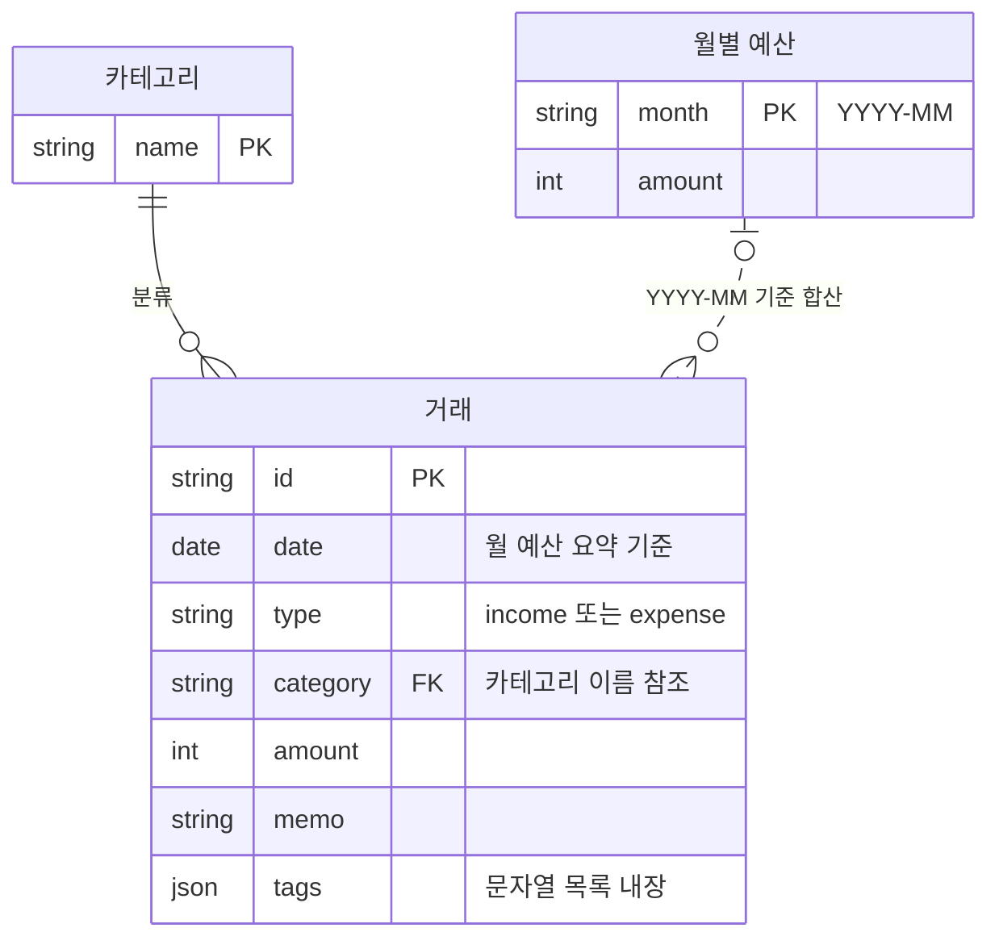

# B2-1 가계부 프로그램 ER 다이어그램

[FigJam에서 열기](https://www.figma.com/board/KcnlykSWgqTs3Vx7NH2CC7)

## 모델 참고

- 프로그램은 관계형 데이터베이스가 아니라 `transactions.jsonl`, `categories.jsonl`, `budgets.jsonl` 파일에 데이터를 저장합니다.
- 거래의 `category`는 카테고리의 `name`을 참조하며, 서비스 계층에서 등록 여부를 확인합니다. 파일에는 실제 DB 외래 키가 없습니다.
- 월별 예산은 거래 날짜의 `YYYY-MM` 값으로 요약에 사용됩니다. 이 연결은 계산상 관계이며 파일에 외래 키로 저장되지 않습니다.
- `tags`는 별도 엔터티가 아니라 거래 안에 저장되는 문자열 목록입니다.
