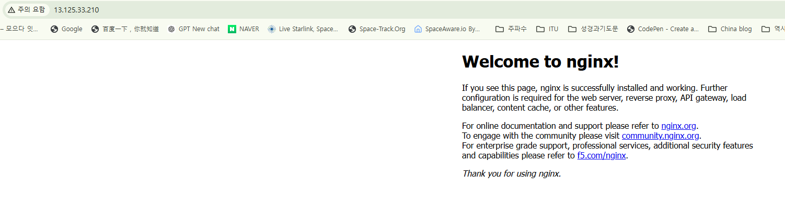

# B6-1 클라우드 환경에서 웹 서비스 인프라 구축

## 결과물 요약

- VPC(`10.0.0.0/16`) + Public Subnet(`10.0.1.0/24`) + Internet Gateway + Route Table로
  외부 접속 가능한 네트워크를 구성했습니다.
- Public Subnet의 EC2 인스턴스에 Nginx를 설치해 웹 서버를 띄웠습니다.
- Security Group으로 HTTP(80)는 전체 허용, SSH(22)는 본인 IP만 허용했습니다.
- IAM 사용자에 EC2/VPC 범위로 제한된 최소 권한 정책을 적용했습니다(AdministratorAccess 미사용).

## 외부 접속 검증

- **선택한 방식**: A. 브라우저 접속 (보조로 B. `/health` 헬스체크도 확인)
- **접속 정보**: `http://13.125.33.210`
- **접속 결과 스크린샷**:

  

## 아키텍처

`docs/architecture.png` 참고 (VPC/Subnet/Internet Gateway/Security Group/EC2와
외부→서비스 트래픽 흐름 표현).

## 네트워크/보안 구성 요약

| 항목 | 값 |
|---|---|
| 리전 | ap-northeast-2 (서울) |
| VPC CIDR | 10.0.0.0/16 |
| Public Subnet CIDR | 10.0.1.0/24 |
| EC2 인스턴스 유형 | t3.micro |
| OS | Amazon Linux 2023 (al2023-ami-2023.12.20260710.0) |
| 퍼블릭 IP | 13.125.33.210 (실습 종료 후 리소스 삭제 완료 — 현재 "삭제됨") |
| SG 인바운드 | HTTP 80 ← 0.0.0.0/0, SSH 22 ← 212.102.51.72/32 |
| IAM 사용자 | `b6-1-lab-user`, `b6_AWS_connect` 정책으로 EC2/VPC 범위 제한(AdministratorAccess 미부여) |

## 실행/배포 방법 요약

1. IAM 사용자(`b6-1-lab-user`)로 콘솔 로그인 (루트 계정 미사용)
2. VPC → Subnet → Internet Gateway → Route Table 순서로 네트워크 구성
3. Security Group 생성 (80/0.0.0.0/0, 22/내IP)
4. EC2 인스턴스 시작 (Amazon Linux 2023, SSH 접속 후 `dnf install -y nginx`로 수동 설치)
5. 내부 검증: `curl -i http://localhost` → 200, `curl -i https://example.com` → 아웃바운드 확인
6. 외부 검증: 브라우저로 `http://13.125.33.210` 접속 → "Welcome to nginx!" 확인
7. 실습 종료 후 `docs/cleanup-checklist.md` 순서대로 전체 삭제

## 트러블슈팅

실제로 겪은 문제와 해결 과정은 [`docs/troubleshooting.md`](docs/troubleshooting.md)에
기록했습니다.

## 리소스 정리

실습 종료 후 리소스 정리 내역은 [`docs/cleanup-checklist.md`](docs/cleanup-checklist.md)에
기록했습니다.

---

## (보너스, 진행했다면 작성) Docker 컨테이너 배포

- 실행한 이미지: `<이미지명:태그>`
- 실행 방식/포트 매핑: `<docker run ... -p 80:80 ...>`
- 검증 스크린샷:
  - `docker ps` (컨테이너 Up 상태): `docs/screenshots/<파일명>.png`
  - 외부 접속 결과: `docs/screenshots/<파일명>.png`

## (보너스, 진행했다면 작성) HTTPS 적용

- 도메인: `<서브도메인 또는 보유 도메인>`
- 인증서 발급 방식: `<Let's Encrypt / certbot 등>`
- 검증 스크린샷: `docs/screenshots/<파일명>.png`
